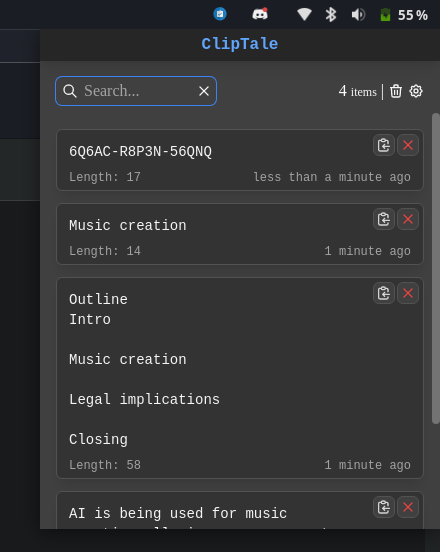
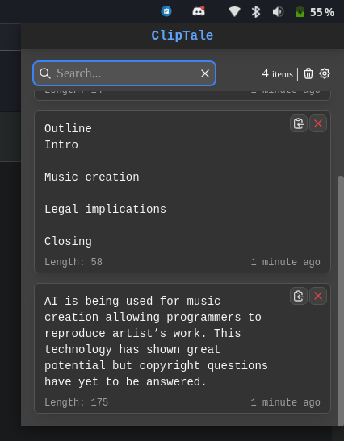

# ClipTale

This is a desktop app made in electron to track and manage your clipboard history.

### Stack

-   [Electron.js](https://www.electronjs.org/)
-   [React](https://reactjs.org/)
-   [TailwindCSS](https://tailwindcss.com/)
-   [Typescript](http://typescriptlang.org/)

### Demo

<div align="center">
    
    
</div>

### Run the app locally

-   Clone the repository

```
git clone https://github.com/FourLineCode/cliptale.git
```

-   Install dependencies

```
pnpm install
```

-   Run the app

```
pnpm start
```

##### Build executable / installable

-   Executable

```
pnpm package
```

-   Installable

```
pnpm make
```
